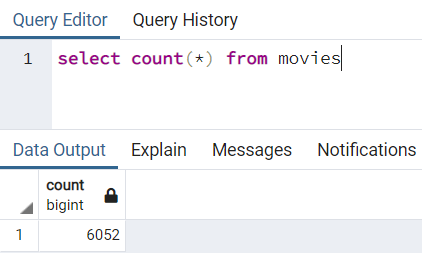
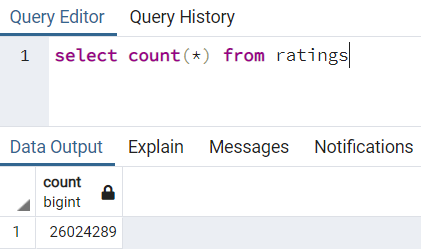

# Movies-ETL

## Overview of the analysis

Extract Wikipedia movie data from a json file, Kaggle movie metadata and MovieLens rating data from csv files, transform the datasets by cleaning them up and joining them, and load the cleaned dataset into a SQL database. 

## Results

### Deliverable 1: ETL_function_test.ipynb

ETL function to read three data files and create three separate DataFrames.

### Deliverable 2: ETL_clean_wiki_movies.ipynb

Extract and transform the Wikipedia data to merge it with the Kaggle metadata.

### Deliverable 3: ETL_clean_kaggle_data.ipynb

Extract and transform the Kaggle metadata and MovieLens rating data and convert the transformed data into separate DataFrames. Then, merge the Kaggle metadata DataFrame with the Wikipedia movies DataFrame to create the movies_df DataFrame. Finally, merge the MovieLens rating data DataFrame with the movies_df DataFrame to create the movies_with_ratings_df.

### Deliverable 4: ETL_create_database.ipynb

Add the movies_df DataFrame and MovieLens rating CSV data to a SQL database.

Movie tabe has 6,052 rows:

Ratings table has 26,024,289 rows:

